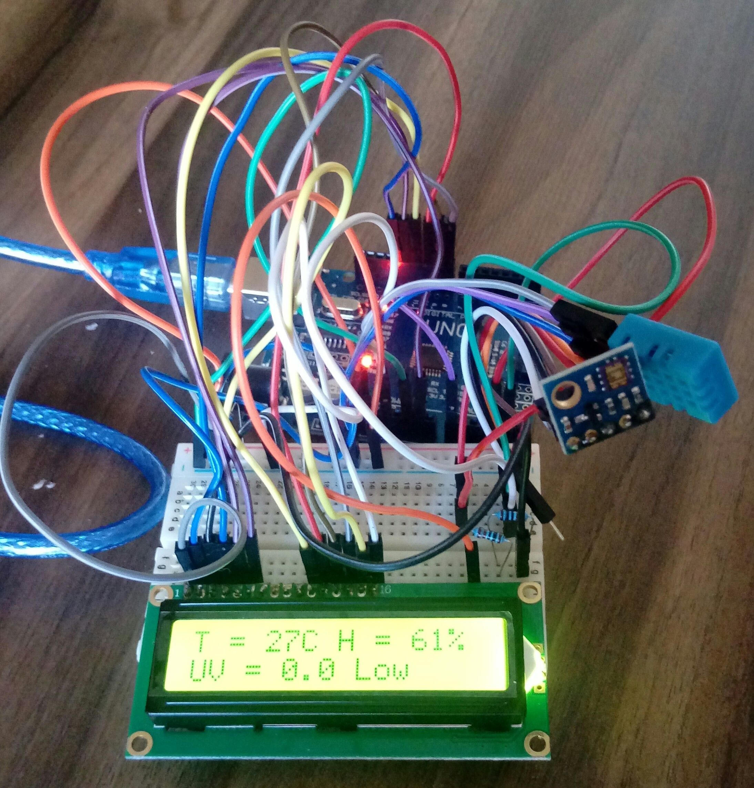

# UV, Temperature and Humidity Measurer

Arduino project of a UV, temperature and humidity measurer with display.

## Hardware Requirement

- 1 Arduino uno.
- 1 Arduino uno USB cable.
- 1 Led display. I'm using a 16x2 like [this](https://www.arduino.cc/en/uploads/Tutorial/lcd_photo.png).
- 1 DHT11, temperature and humity sensor.
- 1 ML8511. I'm using a GY-ML8511.
- Some jump wires (male-male and male-female).
- 3 resistors.

If you'd like to use it without being connected to computer, a 9V battery and clip connect it to arduino.

## Software Requirement

- Arduino IDE.

Open the [arduino program file](https://github.com/lucasguesserts/UV_temperature_humidity/blob/master/lcd_temperature_UV_display.ino) and add the library file [library file](https://github.com/lucasguesserts/UV_temperature_humidity/blob/master/lib.zip), "sketch -> import library -> add library -> select the zip file".

## Diagram

There is a [fritzing diagram](https://github.com/lucasguesserts/UV_temperature_humidity/blob/master/diagram.fzz) that describes how to mount it. It can be opened with [fritzing](http://fritzing.org/home/).

## Reference

[ML 8511 datasheet](https://www.mcs.anl.gov/research/projects/waggle/downloads/datasheets/lightsense/ml8511.pdf).

[ML 8511 how to use](https://learn.sparkfun.com/tutorials/ml8511-uv-sensor-hookup-guide).

[How to use a lcd display](https://www.arduino.cc/en/Tutorial/HelloWorld).

[Lcd display explayned](https://youtu.be/85LvW1QDLLw).

[How to use DHT11 (portuguese)](https://www.filipeflop.com/blog/monitorando-temperatura-e-umidade-com-o-sensor-dht11/).
